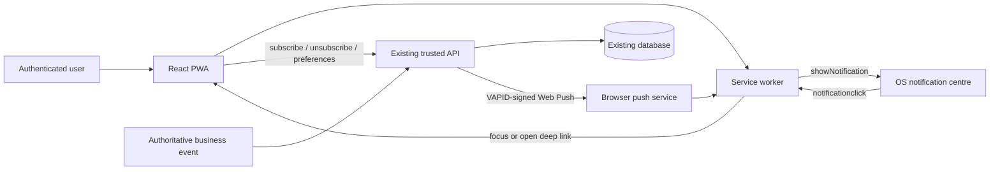

# Product Requirements Document: Marley Ops Web Push Notifications

**Status:** Discovery-ready; implementation follows Phase 0 decisions  
**Audience:** Claude Code and Marley Ops maintainers  
**Product:** Marley Ops  
**Document type:** Product and technical requirements  
**Last updated:** 15 July 2026  

## 1. Executive summary

Add standards-based Web Push notifications to the existing React-based Marley Ops application and complete its Progressive Web App (PWA) foundation. The solution must use the browser Push API, Notifications API, a service worker, and VAPID-authenticated server-side delivery through the application's existing small API. It must not require Firebase, a native mobile application, or a new third-party notification account.

The first release will notify authenticated Marley Ops users about selected operational events when the app is in the foreground, background, or closed. Users must explicitly opt in, subscriptions must be stored securely per user and device, and delivery failures must be handled without affecting the originating business transaction.

Claude Code must begin with repository discovery. This PRD deliberately does not assume whether the current React application uses Vite, Create React App, Next.js, a custom build, or which server framework/database powers the existing API. Implementation choices must reuse the current stack where practical and document any material deviation from this PRD.

## 2. Goals

1. Deliver useful, timely operational notifications on supported Android, iOS/iPadOS, Windows, macOS, ChromeOS, and Linux browsers.
2. Preserve a single React/PWA codebase and use the existing API and datastore.
3. Avoid Firebase and other new managed notification services.
4. Provide a clear, contextual opt-in experience rather than prompting on first page load.
5. Support multiple installations/browsers per user.
6. Deep-link a notification click to the relevant Marley Ops screen.
7. Make push delivery observable, secure, testable, configurable, and safe to roll back.
8. Ensure unsupported or denied environments degrade cleanly with no loss of core application functionality.

## 3. Non-goals for the first release

- Native iOS or Android applications.
- Guaranteed delivery, SMS replacement, emergency alerting, or safety-critical communications.
- Rich media, scheduled summaries, geofencing, silent/background data processing, or arbitrary background execution.
- A general-purpose marketing campaign system.
- Cross-device badge synchronisation unless the existing application already has a reliable unread-task model.
- Notification action buttons that mutate business data directly. Initial actions should open an authenticated Marley Ops route.
- Replacing any existing in-app real-time mechanism.

## 4. Product principles and constraints

- Push is best-effort. Critical workflows must remain visible inside Marley Ops and must not rely only on notification delivery.
- Permission is controlled by the browser/OS. Marley Ops cannot re-prompt after denial; it can only explain how the user may change browser settings.
- VAPID private keys and push-send credentials are server-side secrets and must never reach the React bundle, service worker, repository, logs, or client storage.
- A push subscription is an opaque credential-like endpoint. Treat it as sensitive user data.
- The originating business operation must succeed or fail independently of push delivery.
- Use feature flags and category preferences so notifications can be disabled without redeploying.
- Reuse the existing authentication, authorization, API conventions, persistence layer, validation, logging, tests, and deployment platform.

## 5. Required repository discovery (Phase 0)

Before editing code, Claude Code must inspect and record the following in an implementation note or PR description:

1. Package manager, React version, build tool, routing library, TypeScript/JavaScript choice, lint/test commands, and deployment target.
2. Existing PWA assets: manifest, service worker, service-worker registration, icons, offline caching, install UX, and any PWA plugin.
3. The location, runtime, language, and deployment model of the existing API. Confirm it can safely hold VAPID secrets and initiate outbound HTTPS requests.
4. Authentication/session model and how API routes identify the current user.
5. Existing database/persistence layer, migration system, naming conventions, and user/tenant model.
6. Existing operational event creation paths and the authoritative code locations for the candidate notification categories.
7. Existing in-app notifications, unread counts, SignalR/WebSocket/SSE/polling, background jobs, queues, or event bus.
8. Existing URL/route patterns for jobs, enquiries, customers, schedules, tasks, and settings.
9. Content Security Policy, CORS, CSRF protection, rate limiting, logging/redaction, environment variables, and secret-management conventions.
10. Current browser support policy and whether staff use managed devices or browsers.
11. Whether the application is already served over HTTPS in every non-local environment. Web Push requires a secure context; localhost is the development exception.
12. Whether multiple businesses/tenants share the deployment and, if so, the tenant isolation rules.

If the existing “small API” is client-side code only and no trusted server/serverless runtime exists, stop and surface this blocker. Propose the smallest serverless implementation on the current hosting platform; do not put VAPID private keys in React.

## 6. Assumptions to validate

| ID | Assumption | Required response if false |
|---|---|---|
| A1 | Marley Ops has a trusted server or serverless API runtime. | Add a minimal serverless API design and obtain approval before implementation. |
| A2 | Users authenticate and have stable user IDs. | Define the identity key used to own subscriptions. |
| A3 | The API has persistent storage and migrations. | Select an existing durable store; do not use process memory. |
| A4 | Production uses HTTPS. | Fix HTTPS before enabling Web Push. |
| A5 | Operational events have authoritative server-side creation paths. | Identify a safe trigger; do not trust client-only requests to send arbitrary pushes. |
| A6 | React routes can represent notification destinations. | Add or map stable deep links. |
| A7 | The app can register one service worker for its scope. | Reconcile with the existing worker/plugin; never register competing root workers. |
| A8 | Push volume is modest enough for direct asynchronous sends initially. | Introduce the existing queue/job mechanism or propose one if fan-out can block requests. |
| A9 | Notifications contain operational, not highly sensitive, detail. | Reduce lock-screen content and require opening the authenticated app. |

## 7. User stories

- As an authenticated operator, I can understand why Marley Ops wants notification permission before the browser prompt appears.
- As an operator on a supported device, I can enable notifications for this installation.
- As an operator with multiple devices, I can receive notifications on each opted-in installation.
- As an operator, I can choose which enabled categories I receive, subject to product policy.
- As an operator, clicking a notification opens or focuses Marley Ops at the relevant record.
- As an operator whose session expired, I am taken through login and then returned to the intended safe destination.
- As an operator who denied permission, I see accurate recovery instructions and the app continues to work.
- As an administrator, I can disable all Web Push or individual categories without a new deployment.
- As a maintainer, I can identify attempted, successful, invalid-subscription, and failed sends without logging sensitive endpoints or payloads.

## 8. Proposed architecture



### 8.1 Component responsibilities

**React application**

- Detect support, installation context, and current permission.
- Explain the value of notifications before invoking the native permission prompt.
- Register the service worker, subscribe/unsubscribe, send subscriptions to the API, and manage category preferences.
- Display current state: unsupported, available, enabled, denied, or error.

**Service worker**

- Receive push events, validate defensively, and display notifications.
- Handle notification clicks and close events.
- Focus an existing same-origin window where possible, otherwise open the permitted relative route.
- Integrate with the existing caching worker rather than replacing it.

**Existing API**

- Expose the public VAPID key to authenticated clients (or safe public configuration).
- Store and remove subscriptions owned by the authenticated user.
- Validate payload shape and ownership; never accept an arbitrary target user or arbitrary notification body from an ordinary client.
- Resolve event recipients and preferences server-side.
- Send VAPID-authenticated Web Push requests and prune expired subscriptions.
- Log aggregate outcomes with sensitive values redacted.

**Existing database**

- Store multiple subscriptions per user, device metadata, category preferences, lifecycle timestamps, and invalidation state.

### 8.2 Delivery sequence

1. The user opens notification settings and selects **Enable notifications**.
2. React confirms support and service-worker readiness, then asks the browser for permission.
3. If granted, React calls `pushManager.subscribe()` with `userVisibleOnly: true` and the VAPID public key.
4. React sends the resulting subscription to the authenticated API.
5. The API upserts the subscription for the current user and installation.
6. An authoritative server-side business event occurs.
7. The API determines recipients, enabled categories, and eligible active subscriptions.
8. The API constructs a minimal allowlisted payload and sends it through each subscription's browser push service.
9. The service worker displays a visible notification.
10. On click, the service worker focuses/opens a same-origin allowlisted route.
11. If the API receives HTTP 404 or 410 from a push service, it disables or deletes that subscription.

## 9. Browser and platform compatibility

Compatibility must be verified against current official browser documentation during implementation and recorded in the PR. Do not rely solely on user-agent detection; use feature detection.

| Platform | Expected behaviour | Key limitation / UX requirement |
|---|---|---|
| Android Chromium browsers | Strong PWA and Web Push support; installed and browser contexts may work. | Exact presentation and battery behaviour are OS/browser controlled. |
| Desktop Chrome/Edge and compatible Chromium | Web Push supported while browser background services are available. | OS/browser notification settings can suppress delivery. |
| Desktop Firefox | Web Push supported. | Test payload, actions, and click behaviour independently. |
| macOS Safari | Web Push supported on supported Safari/macOS releases. | Validate manifest and permission flow on the supported release baseline. |
| iOS/iPadOS Safari | Web Push is available only for an installed Home Screen web app on supported OS versions. | The user must add the PWA to the Home Screen, launch it there, and grant permission from a user gesture. No useful prompt should be shown in a normal Safari tab. |
| Unsupported/older browsers | No push functionality. | Hide/disable enablement and show a concise explanation; core app remains functional. |

Required feature checks include `serviceWorker` in `navigator`, `PushManager` availability, and `Notification` availability. Also inspect `Notification.permission`. Installation-state checks should use supported display-mode signals and iOS-specific fallback only where necessary.

The UI must not claim notifications are guaranteed or exactly equivalent to native notifications. Delivery timing, grouping, sounds, badges, action support, and notification persistence vary by browser, OS, focus mode, power-saving policy, and user settings.

## 10. PWA manifest requirements

Create or update a single web app manifest linked from the application HTML. Preserve valid existing product values and branding. Minimum requirements:

```json
{
  "id": "/",
  "name": "Marley Ops",
  "short_name": "Marley Ops",
  "start_url": "/",
  "scope": "/",
  "display": "standalone",
  "background_color": "#FFFFFF",
  "theme_color": "<existing Marley Ops theme colour>",
  "icons": [
    {
      "src": "/icons/icon-192.png",
      "sizes": "192x192",
      "type": "image/png",
      "purpose": "any"
    },
    {
      "src": "/icons/icon-512.png",
      "sizes": "512x512",
      "type": "image/png",
      "purpose": "any maskable"
    }
  ]
}
```

Use real, correctly padded brand icons; do not generate placeholders in production. Validate the manifest in target browser developer tools. Keep `scope` and `start_url` consistent with the actual deployment base path. Add Apple-specific metadata/icons only if needed by the current setup and supported device matrix.

## 11. Service worker requirements

Use the existing build tool's supported service-worker strategy. If a PWA plugin already owns the service worker, extend its generated/custom worker using the plugin's documented mechanism. Do not create a second root-scoped worker.

### 11.1 Push handling

The worker must:

- Listen for `push` and always show a user-visible notification for a received application push.
- Parse JSON defensively and use a safe generic fallback if the payload is missing or malformed.
- Populate `title`, `body`, `icon`, `badge` where supported, `tag`, `data.url`, and `data.notificationId` from a strict payload contract.
- Avoid exposing customer phone numbers, full addresses, payment data, access tokens, or other sensitive content on a lock screen.
- Use stable tags only when replacement/deduplication is intended.
- Avoid `requireInteraction` unless validated as necessary across supported browsers.

Example logical payload (exact schema may follow existing conventions):

```json
{
  "version": 1,
  "notificationId": "uuid",
  "category": "new_enquiry",
  "title": "New enquiry",
  "body": "A new removal enquiry needs review.",
  "url": "/enquiries/123",
  "tag": "enquiry-123",
  "createdAt": "2026-07-15T10:30:00Z"
}
```

### 11.2 Click handling

- Call `event.notification.close()`.
- Accept only same-origin, allowlisted relative routes. Reject external URLs, `javascript:` URLs, protocol-relative URLs, and unexpected schemes.
- Find an existing same-origin window client; focus it and navigate if appropriate, otherwise call `clients.openWindow()`.
- The destination route must re-authorize access. A deep link is not authorization.
- If authentication is required, preserve the route using the application's existing safe return-path mechanism.
- Optionally report a click/open event after the app loads; push-service delivery receipts are not generally available.

### 11.3 Update and caching safety

- Do not cache authenticated API responses or sensitive records unless the existing offline architecture explicitly and securely does so.
- Preserve the app's current service-worker update UX. Do not force an uncontrolled `skipWaiting()`/reload loop.
- Version caches and remove obsolete caches according to the existing PWA strategy.
- Push must still function if offline; the deep-linked record may show the existing offline/error state until connectivity returns.

## 12. VAPID and Web Push implementation

Use a maintained Web Push library compatible with the existing server runtime. Prefer the standard `web-push` package only if the API runs on a supported Node runtime; otherwise use the equivalent established library for the existing runtime.

### 12.1 Key management

- Generate one VAPID public/private key pair using the chosen library's supported CLI/API.
- Store `WEB_PUSH_VAPID_PUBLIC_KEY`, `WEB_PUSH_VAPID_PRIVATE_KEY`, and `WEB_PUSH_VAPID_SUBJECT` in the existing secret-management system.
- Use a monitored `mailto:` address or valid HTTPS origin as the VAPID subject.
- Expose only the public key to the client.
- Use separate keys for local/staging/production unless the existing environment policy explicitly chooses otherwise.
- Never rotate keys casually: existing subscriptions are tied to the application server key and may need re-subscription after rotation.
- Document generation, storage, recovery, rotation, and environment setup without recording the private value.

### 12.2 Sending behaviour

- Send only from trusted server code.
- Configure an appropriate TTL by category; stale operational alerts should expire rather than arrive much later.
- Use low/normal urgency by default and high urgency only for genuinely time-sensitive operational events.
- Bound concurrency and request duration. For small recipient sets, asynchronous direct fan-out is acceptable; for larger sets, use the application's existing job/queue mechanism.
- Push failures must not roll back or fail the originating business transaction.
- Dispatch only after the business transaction commits. Prefer the application's existing durable queue/job/outbox. If none exists and each event has a very small bounded fan-out, the API may await a bounded send after commit; never use unawaited “fire-and-forget” work in a request-scoped/serverless runtime. Record the crash/loss trade-off during Phase 0.
- Treat 404/410 as permanent invalidation. Treat 429 and 5xx/network failures as transient and retry only with bounded exponential backoff if the existing job infrastructure supports it.
- Do not retry permanent 4xx errors other than a documented transient response.
- Never log the full subscription endpoint, `p256dh`, `auth`, VAPID private key, Authorization header, or complete sensitive payload.

## 13. API contracts

Adapt paths and response envelopes to existing conventions. All mutation routes require authentication, authorization, input validation, CSRF protection where relevant to the current auth model, and rate limiting.

### 13.1 Get push capability/configuration

`GET /api/push/config`

Response `200`:

```json
{
  "enabled": true,
  "vapidPublicKey": "<URL-safe Base64 public key>",
  "categories": [
    { "id": "new_enquiry", "label": "New enquiries", "defaultEnabled": true },
    { "id": "job_update", "label": "Job updates", "defaultEnabled": true }
  ]
}
```

The public VAPID key is not a secret. If the route is public, it must expose no user-specific configuration. Prefer authenticated access if that matches current API conventions.

### 13.2 Register/upsert a subscription

`POST /api/push/subscriptions`

Request:

```json
{
  "endpoint": "https://push-service.example/...",
  "expirationTime": null,
  "keys": {
    "p256dh": "<URL-safe Base64 value>",
    "auth": "<URL-safe Base64 value>"
  },
  "installationId": "<random UUID stored locally>",
  "userAgent": "<optional; server may derive this instead>"
}
```

Response `200` or `201`:

```json
{
  "subscriptionId": "uuid",
  "status": "active",
  "createdAt": "2026-07-15T10:00:00Z",
  "updatedAt": "2026-07-15T10:00:00Z"
}
```

Rules:

- Ownership comes exclusively from the authenticated session, never a request `userId`.
- Validate endpoint URL length/scheme and exact key shape/size within library expectations.
- Upsert idempotently using a collision-resistant endpoint fingerprint scoped to application origin and VAPID environment—not tenant.
- If an endpoint was previously associated with another user or tenant, transactionally revoke its previous ownership before assigning it to the current authenticated user. Never leave two active records for one endpoint or inherit the previous owner's preferences.

### 13.3 Remove the current installation subscription

`DELETE /api/push/subscriptions`

Request:

```json
{
  "endpoint": "https://push-service.example/...",
  "installationId": "<random UUID>"
}
```

Response: `204 No Content`. The operation should be idempotent and may mark the record revoked rather than hard-delete it for audit purposes.

### 13.4 Get/update preferences

`GET /api/push/preferences`

Response `200`:

```json
{
  "globalEnabled": true,
  "categories": {
    "new_enquiry": true,
    "job_update": true,
    "schedule_change": true
  }
}
```

`PUT /api/push/preferences`

Request uses the same shape. The API must reject unknown categories and enforce any mandatory-policy categories explicitly. Decide during discovery whether preferences apply per user across devices or per subscription; user-level preferences are the recommended default.

### 13.5 Internal send interface

Do not expose a general authenticated “send arbitrary push” route to ordinary users. Business code should call an internal typed service such as:

```ts
sendPushForEvent({
  eventType: "new_enquiry",
  entityId: enquiryId,
  actorUserId,
  tenantId
})
```

The server maps the event to recipients, approved copy, safe route, tag, TTL, and urgency. If an administrative test endpoint is necessary, restrict it to authorized administrators, target only the requesting user's subscriptions, use fixed test content, rate-limit it, and disable it in production unless explicitly required.

### 13.6 Error contract

Follow existing error envelopes. At minimum distinguish:

- `400` malformed subscription/preferences.
- `401` unauthenticated.
- `403` unauthorized or tenant mismatch.
- `409` state conflict if required by current conventions.
- `429` rate-limited.
- `503` push globally disabled or temporarily unavailable.

Never return secrets or raw push-provider error bodies to the browser.

## 14. Data model

Map this logical model onto the current database conventions.

### 14.1 `push_subscriptions`

| Field | Purpose |
|---|---|
| `id` | Primary key (UUID or current standard). |
| `user_id` | Required owner, foreign key to users. |
| `tenant_id` | Required if Marley Ops is multi-tenant. |
| `installation_id` | Random client installation identifier; not a hardware ID. |
| `endpoint` or encrypted value | Browser push endpoint. Use the application's established field-encryption mechanism. If none exists, document the risk and storage controls before implementation; never invent ad hoc cryptography. |
| `endpoint_hash` | HMAC/hash for lookup, uniqueness, and redacted diagnostics. |
| `p256dh` | Subscription public encryption key; sensitive. |
| `auth_secret` | Subscription authentication secret; sensitive. |
| `expiration_time` | Nullable browser-supplied expiry. |
| `status` | `active`, `revoked`, or `invalid`. |
| `user_agent` | Optional bounded diagnostic string. |
| `platform` / `browser` | Optional coarse derived metadata; do not depend on it for capability. |
| `last_seen_at` | Last successful client reconciliation. |
| `last_success_at` | Last successful push-service acceptance. |
| `last_failure_at` | Last failed attempt. |
| `failure_count` | Consecutive or lifetime count, clearly defined. |
| `created_at`, `updated_at`, `revoked_at` | Lifecycle timestamps. |

Recommended constraints/indexes:

- Unique endpoint fingerprint per application origin and VAPID environment. A browser endpoint has only one active owner at a time, even when users or tenants change.
- Index active subscriptions by `user_id` (and `tenant_id` if applicable).
- Bounded lengths on all externally supplied strings.
- Cascade or explicit cleanup consistent with user deletion policy.

### 14.2 `push_preferences`

Use either one row per user/category or a validated JSON structure, following current database style.

| Field | Purpose |
|---|---|
| `user_id` | Preference owner. |
| `tenant_id` | Tenant scope if applicable. |
| `category` | Allowlisted category identifier. |
| `enabled` | User choice. |
| `created_at`, `updated_at` | Audit timestamps. |

### 14.3 Optional delivery log

Do not create a high-volume log table unless needed. Existing structured telemetry may be sufficient. If persisted, retain only notification ID, category, recipient/subscription IDs, outcome class, HTTP status, attempts, and timestamps—never keys or full endpoints. Define a retention period.

## 15. Notification categories

Claude Code must locate the real Marley Ops entities and event sources before enabling categories. Recommended first-release candidates:

| Category | Trigger | Audience | Safe default copy | Deep link | Suggested TTL |
|---|---|---|---|---|---|
| `new_enquiry` | New enquiry committed successfully | Relevant ops/admin users | “A new removal enquiry needs review.” | Enquiry detail | 4 hours |
| `job_update` | Material job status change | Assigned/relevant users | “A job has been updated.” | Job detail | 4 hours |
| `schedule_change` | Assignment/date/time materially changes | Assigned staff/ops | “A scheduled job has changed.” | Schedule/job detail | 12 hours |
| `task_assigned` | Task assigned to user | Assignee | “A task has been assigned to you.” | Task detail | 24 hours |
| `payment_event` | Deposit/payment state changes | Authorized ops users | “A payment status has changed.” | Authorized job/payment view | 4 hours |
| `missed_follow_up` | Existing system identifies an overdue follow-up | Responsible user | “A follow-up needs attention.” | Enquiry/task detail | 8 hours |

For v1, implement only categories with an authoritative server-side event and an existing deep-link destination. Start with two or three high-value, low-noise categories rather than enabling every candidate.

Rules:

- Never include full address, phone number, payment amount, or sensitive customer notes by default.
- Suppress notifications caused by the recipient's own action where that alert adds no value.
- Prevent duplicates using the business event ID or another idempotency key.
- Define a canonical event/delivery identity. A durable dispatcher should enforce a unique `(event_id, category, recipient_user_id)` record (or equivalent) so transaction and worker retries cannot create duplicate logical notifications.
- Avoid notification storms from bulk edits; aggregate or suppress where appropriate.
- Copy must remain understandable without revealing sensitive details on a locked screen.

## 16. UX requirements

### 16.1 Permission journey

1. Do not invoke `Notification.requestPermission()` automatically on page load or immediately after login.
2. Present a contextual in-app explanation after the user has seen value, or in Settings > Notifications.
3. On explicit **Enable notifications**, perform capability/install checks and request permission from that user gesture.
4. If granted, create and persist the subscription, then show a clear enabled state.
5. If denied, do not repeatedly prompt. Explain that browser/OS settings control recovery.
6. If dismissed/default, leave the feature available for a later user-initiated attempt without nagging.
7. On iOS/iPadOS when not launched as an installed Home Screen app, show concise Add to Home Screen instructions instead of requesting permission.

Suggested pre-prompt copy:

> Get operational updates even when Marley Ops is closed. You control which alerts you receive and can turn them off at any time.

### 16.2 Settings states

The settings UI must accurately distinguish:

- **Unsupported:** browser/device lacks required APIs.
- **Install required:** supported iOS/iPadOS but not running as an installed Home Screen app.
- **Available:** permission not yet granted and no active subscription.
- **Enabled:** permission granted, browser subscription exists, and server reconciliation succeeded.
- **Blocked:** permission denied at browser/OS level.
- **Needs repair:** permission granted but subscription/server registration failed.
- **Disabled by administrator:** feature flag off.

Display category toggles only when push is enabled or make their future effect unambiguous. Include **Send test notification** only if implemented with the restricted server-side contract described above.

### 16.3 Subscribe, reconciliation, logout, and unsubscribe

- Generate a random `installationId` and keep it in appropriate local storage; it is not a stable hardware identifier.
- On authenticated app startup or settings visit, compare `pushManager.getSubscription()` with server state and repair missing registration with bounded attempts.
- On enable, wait for service-worker readiness before subscribing.
- On disable, call browser `subscription.unsubscribe()` and revoke the server record. If one half fails, show an actionable partial-failure state and retry safely.
- Decide and document logout behaviour during discovery. Recommended default for shared operational devices: revoke the current installation's server association on logout so the prior user receives nothing. Re-subscribe/reassociate after the next user explicitly enables or confirms notifications.
- A subscription change event, where supported, should reconcile the replacement subscription with the API; normal startup reconciliation remains necessary.

### 16.4 In-app and foreground behaviour

Push notifications may still appear while the app is focused. Avoid building complex foreground suppression in v1 unless user testing shows duplicate/noisy alerts. If the application already receives the same event in real time, define a single deduplication ID so an in-app toast and system notification do not create confusing duplicates.

## 17. Security, privacy, and abuse prevention

1. Authenticate every subscription and preference mutation.
2. Derive owner and tenant from the trusted session; never trust client-supplied ownership fields.
3. Authorize event recipients server-side using existing roles and tenant boundaries.
4. Use an allowlist for categories, copy templates, and deep-link route patterns.
5. Keep VAPID private keys in server-side secret storage; scan built assets to ensure they are absent.
6. Treat endpoints and subscription keys as sensitive; redact logs and error monitoring.
7. Validate body size, field lengths, URL scheme/origin, and JSON shape. Reject unknown fields if consistent with current validation policy.
8. Apply CSRF protection appropriate to cookie-based authentication and current API standards.
9. Rate-limit subscription churn and any test-send function.
10. Never permit arbitrary user-entered notification content or arbitrary external URLs in v1.
11. Use minimal lock-screen content. Opening the app must re-authenticate/re-authorize the record.
12. Define data retention, account deletion, user disablement, and tenant deletion behaviour for subscriptions.
13. Revoke subscriptions on relevant security events if required by existing session policy.
14. Review Content Security Policy and service-worker scope without weakening unrelated controls.
15. Protect against SSRF by never allowing the client to ask the server to POST to an arbitrary endpoint. Only stored, validated subscriptions may be used by the internal sender.
16. Run dependency and secret scans using the repository's existing tooling.

## 18. Reliability and observability

Minimum structured metrics/events:

- Permission funnel: eligible, pre-prompt shown, granted, denied/dismissed (where observable), subscribed, server-registered.
- Active subscriptions by environment and coarse platform.
- Send attempts and push-service accepted responses by category.
- Permanent invalidations (404/410), rate limits (429), transient failures, and unexpected errors.
- Notification click/open events where observable.
- Subscription reconciliation failures.

Do not label a push-service `201/202` response as confirmed user delivery; it confirms acceptance by the push service, not display or reading. Add correlation IDs and category/event IDs without logging payload secrets. Alert only on actionable patterns such as sustained failure rate, invalid VAPID configuration, or a sudden invalidation spike.

## 19. Performance requirements

- PWA and push code must not materially delay initial rendering.
- Register the service worker using the build tool's recommended lifecycle.
- Notification settings should lazy-load nonessential code if the current architecture supports it.
- Business API requests must not wait for multi-recipient fan-out. Use existing durable background work where available. Without it, a very small bounded send may be awaited after commit as an explicitly documented v1 compromise; never start unawaited request-scoped work that a serverless runtime may terminate.
- Bound payload size well below push-service limits; target compact JSON under approximately 3 KB before encryption.
- Queries must use indexed user/tenant/status lookups and avoid N+1 preference queries.

## 20. Testing strategy

### 20.1 Automated unit tests

- URL-safe Base64 conversion for the VAPID application key.
- Capability and UI-state derivation.
- Permission state transitions.
- Payload validation, safe fallback, and deep-link allowlisting.
- Category preference resolution and recipient selection.
- Notification copy/TTL/urgency mapping.
- Error classification: success, 404/410 invalidation, 429/transient, permanent failure.
- Sensitive-value redaction.
- Own-action suppression and idempotency/deduplication.

### 20.2 API/integration tests

- Authenticated subscription upsert and idempotency.
- No ability to register for another user or tenant.
- Validation rejects malformed endpoints/keys, excessive lengths, and unknown categories.
- Unsubscribe is idempotent and scoped to the current user/installation.
- Preference reads/writes follow ownership and defaults.
- A fake/stub push transport verifies payload and headers without contacting a real push service.
- 404/410 disables the subscription; transient failure does not.
- Business transaction success is independent of push transport failure.
- Logout/account deletion follows the chosen revocation policy.

### 20.3 Service-worker tests

- Valid push shows the expected notification options.
- Missing/malformed payload shows a safe generic notification and does not crash the worker.
- Click closes the notification and focuses an existing client or opens a new client.
- Unsafe/external destinations fall back to the app root.
- Existing cache/update behaviour continues to work.

Use the project's established service-worker test tooling. If no practical automated worker harness exists, cover logic in pure tested functions and document the manual browser cases.

### 20.4 Manual device/browser matrix

Test real devices where possible, not only emulation:

| Scenario | Android Chrome | iPhone/iPad Home Screen PWA | Desktop Chrome/Edge | Desktop Firefox | macOS Safari |
|---|---:|---:|---:|---:|---:|
| Install/open as PWA | Baseline | Baseline | Baseline | If supported and in baseline | Baseline |
| Contextual permission flow | Baseline | Baseline | Baseline | Baseline | Baseline |
| Receive foreground/background/closed | Baseline | Baseline | Baseline | Baseline | Baseline |
| Click opens correct route | Baseline | Baseline | Baseline | Baseline | Baseline |
| Expired login returns to route safely | Baseline | Baseline | Baseline | Baseline | Baseline |
| Disable/unsubscribe | Baseline | Baseline | Baseline | Baseline | Baseline |
| Denied permission recovery UX | Baseline | Baseline | Baseline | Baseline | Baseline |
| OS focus mode / notifications disabled | Observe | Observe | Observe | Observe | Observe |
| Service-worker/application update | Required | Required | Required | Required | Required |

“Baseline” means required only after the supported browser/OS baseline is agreed. Record unavailable physical-device coverage explicitly; do not claim it passed through emulation alone. Also test multiple users on one browser profile, multiple devices for one user, two open tabs, offline notification click, stale/deleted entity routes, tenant boundary attempts, duplicate events, and VAPID misconfiguration in staging.

### 20.5 Quality gates

Before release, run the repository's full baseline and post-change test suite, type-check, lint, production build, dependency audit, and any existing end-to-end tests. Inspect the production build to confirm no private key is bundled. Validate the installed PWA and service worker in browser developer tools, then verify actual notification receipt on the supported matrix.

## 21. Rollout plan

### Phase 0: Discovery and design confirmation

- Complete Section 5 discovery.
- Answer/block the open questions in Section 25.
- Agree the supported browser/OS baseline and who provides or executes physical-device validation.
- Confirm v1 categories, recipients, routes, and safe copy.
- Record the exact architecture and any deviations.

### Phase 1: PWA foundation behind flags

- Manifest/icons and single service-worker lifecycle.
- Feature detection and notification settings UI.
- Database migration and subscription/preferences APIs.
- VAPID secrets configured in development/staging/production secret stores.
- No production business-event sends yet.

### Phase 2: Internal/staging pilot

- Enable a fixed self-test notification for authorized testers.
- Test the full browser/device matrix.
- Enable one low-risk category for a small internal cohort.
- Monitor failures, invalidations, duplicates, noise, and click behaviour.

### Phase 3: Controlled production rollout

- Enable globally for eligible internal users through a server-side flag/cohort.
- Add the remaining approved v1 categories one at a time.
- Keep permission opt-in; never auto-enrol.
- Review metrics and user feedback after each category.

### Phase 4: General availability

- Remove temporary pilot restrictions while keeping kill switches.
- Publish concise internal guidance for iOS installation, permission recovery, and notification settings.
- Establish ownership for monitoring and VAPID key recovery.

### Rollback

Rollback must not require removing the service worker abruptly. Available controls:

1. Disable sends globally through server configuration/feature flag.
2. Disable a noisy category independently.
3. Hide/disable new subscriptions while preserving stored records.
4. Deploy a code rollback if needed, retaining a compatible worker long enough for safe update propagation.
5. Do not rotate/delete VAPID keys as a rollback mechanism.

## 22. Acceptance criteria

### Functional

- [ ] On supported environments, an authenticated user can enable notifications only through an explicit gesture.
- [ ] On supported iOS/iPadOS, the UI requires and explains Home Screen installation before permission is requested.
- [ ] The browser subscription is stored against the authenticated user and current tenant, with multiple devices supported.
- [ ] Repeating registration is idempotent and does not create duplicate active rows.
- [ ] At least one approved real business event sends a notification using fixed, safe server-side content.
- [ ] The notification can arrive while the PWA is not open, subject to browser/OS best-effort behaviour.
- [ ] Clicking the notification focuses/opens Marley Ops at the authorized relevant route.
- [ ] An expired session follows login and safely returns to the destination where supported by existing auth.
- [ ] Users can disable notifications and manage approved category preferences.
- [ ] Unsupported, denied, and failed states are accurately represented without breaking core functionality.
- [ ] Invalid subscriptions are pruned/disabled after permanent push-service responses.

### Security and privacy

- [ ] The VAPID private key exists only in server-side secret storage and is absent from source, logs, and client bundles.
- [ ] Ordinary clients cannot select another recipient, tenant, arbitrary content, or arbitrary destination URL.
- [ ] Subscription endpoints and keys are redacted from logs and protected according to current data policy.
- [ ] Notification content contains no disallowed sensitive customer/payment data.
- [ ] Deep links are same-origin, allowlisted, and re-authorized after open.
- [ ] Subscription, preference, and test endpoints are authenticated, validated, authorized, and rate-limited.

### Reliability and operations

- [ ] Push failure cannot fail or roll back the originating business action.
- [ ] Global and per-category kill switches work without a deployment.
- [ ] Metrics distinguish attempts, push-service acceptance, permanent invalidation, transient failure, and clicks where available.
- [ ] Existing PWA caching/update behaviour and core app flows remain regression-free.
- [ ] Staging and production have documented VAPID configuration and recovery steps.

### Quality

- [ ] Unit, integration, service-worker/pure-logic, and existing repository tests pass.
- [ ] Type-check, lint, production build, and relevant security scans pass.
- [ ] Manual matrix testing is recorded for agreed supported browsers/devices.
- [ ] No private secrets appear in built assets.
- [ ] PR documentation records discovery findings, migrations, environment variables, rollout steps, and known browser limitations.

## 23. Implementation checklist for Claude Code

### Discovery and planning

- [ ] Inspect repository and current runtime using Section 5.
- [ ] Run existing tests before changes and record the baseline.
- [ ] Identify the single existing or intended service worker and its ownership.
- [ ] Identify authoritative event sources and select the smallest v1 category set.
- [ ] Choose and document the post-commit delivery boundary, event identity, retry semantics, and process-crash behaviour.
- [ ] Confirm global-per-application endpoint ownership and transactional reassignment semantics.
- [ ] Resolve all blocking open questions; mark non-blocking decisions in the PR.
- [ ] Produce a file-by-file implementation plan consistent with repository conventions.

### PWA/client

- [ ] Add/update manifest and production-quality icons.
- [ ] Link/validate manifest and required theme metadata.
- [ ] Add or extend one service worker with push and click handlers.
- [ ] Register the worker using the current build tool's supported approach.
- [ ] Add feature/install/permission-state detection.
- [ ] Add contextual pre-prompt and Settings > Notifications UI.
- [ ] Add VAPID public-key conversion and `PushManager.subscribe()` flow.
- [ ] Add authenticated registration, reconciliation, unsubscribe, and preference calls.
- [ ] Handle denied, dismissed, unsupported, install-required, admin-disabled, and repair states.
- [ ] Implement safe focus/open deep-link behaviour.

### Server/API

- [ ] Add validated environment configuration and startup checks for VAPID settings.
- [ ] Add migration/model for subscriptions and preferences.
- [ ] Add config, subscribe, unsubscribe, and preference endpoints using existing conventions.
- [ ] Implement a typed push transport/service with dependency injection or equivalent test seam.
- [ ] Implement payload templates, safe routes, TTL, urgency, recipient resolution, preferences, and deduplication.
- [ ] Integrate the first event only after its business transaction commits.
- [ ] Add permanent invalidation and bounded transient-failure handling.
- [ ] Add global/category feature flags and restricted self-test support if approved.
- [ ] Add redacted structured logs and metrics.

### Security and lifecycle

- [ ] Confirm server-derived user/tenant ownership and authorization.
- [ ] Validate and bound every client field.
- [ ] Apply current CSRF/CORS/rate-limit controls.
- [ ] Add same-origin route allowlisting and payload minimization.
- [ ] Define logout, account deletion, user disablement, and tenant deletion cleanup.
- [ ] Confirm secrets are configured per environment and absent from source/build output.

### Verification and delivery

- [ ] Add unit and integration tests from Section 20.
- [ ] Run complete tests, type-check, lint, production build, audit/scans.
- [ ] Exercise real push delivery in staging across the agreed browser/device matrix.
- [ ] Test app closed/background, expired session, offline click, multiple devices/users, duplicate event, and unsubscribe.
- [ ] Verify feature/category kill switches.
- [ ] Document environment variables, VAPID recovery, schema migration, support instructions, and rollback.
- [ ] Roll out through the phases in Section 21 and monitor outcomes.

## 24. Definition of done

The feature is done when all applicable acceptance criteria are met; repository discovery and architectural/product decisions are recorded; at least one valuable production event works end to end for the agreed pilot; security and the agreed browser matrix pass (with unavailable physical coverage declared); feature flags and rollback are verified; documentation enables another maintainer to configure, diagnose, and safely disable Web Push; and no core Marley Ops workflow depends exclusively on push delivery.

## 25. Open questions for the developer

Claude Code should answer these from the repository, infrastructure, and existing documentation before asking Peter. Questions marked **Product decision** must be surfaced only if the answer cannot be inferred safely.

### Repository and infrastructure

1. Which React build tool, router, language, package manager, and hosting platform are in use?
2. What exactly is the “small API”: runtime, source directory, deployment platform, persistence layer, and secret mechanism?
3. Is a service worker or PWA plugin already present? Which code owns registration, caching, and updates?
4. Does every deployed environment use HTTPS and a stable origin/scope?
5. What migration and test infrastructure exists?
6. Is there a queue/background job system, or should v1 use bounded post-commit direct delivery?
7. What feature-flag/config mechanism already exists?

### Identity, tenancy, and lifecycle

8. How does the API identify the current user, role, and tenant?
9. Is Marley Ops multi-tenant, and what existing rules isolate records and users?
10. Are devices shared between staff? What is the established logout/session-revocation policy?
11. What should happen to subscriptions when a user is disabled/deleted or a tenant is removed?
12. Are category preferences user-wide or device-specific? Recommended: user-wide unless operations require otherwise.

### Product decisions

13. **Product decision:** Which two or three categories are required for the first pilot?
14. **Product decision:** Which roles/users receive each category, including whether the actor should be excluded?
15. **Product decision:** What exact notification copy is acceptable on a locked screen?
16. **Product decision:** Which devices and minimum browser/OS versions must be officially supported?
17. **Product decision:** Should logout revoke this installation's subscription? Recommended: yes for shared/operational devices.
18. **Product decision:** Is an administrator-only “send test notification to myself” control required?
19. **Product decision:** Are any categories mandatory, or can users disable every category? Recommended: allow opt-out unless a clear operational policy requires otherwise.

### Events, routes, and UX

20. Where are new enquiries, job changes, schedule changes, tasks, payments, and follow-ups committed server-side?
21. What stable routes open each entity, and how does expired-login return navigation work?
22. Is there already in-app notification/toast or real-time event functionality requiring deduplication?
23. Where should notification settings live, and what existing design components should be reused?
24. Are correct 192px, 512px, and maskable Marley Ops icons already available?
25. Does the current service-worker update mechanism require user confirmation or automatic activation?

### Operations and compliance

26. What logging/metrics service is available, and what data-redaction rules apply?
27. What retention/deletion policy applies to subscription records and optional delivery logs?
28. Who owns the VAPID contact subject, production secret access, and key recovery?
29. What cohort should receive the staging and production pilot?
30. What failure/noise threshold should pause rollout or disable a category?
31. Who will provide or execute validation on each physical device/browser in the agreed support baseline?
32. What concrete retention periods apply to revoked/invalid subscriptions and any persisted delivery telemetry?

## 26. Decisions the developer may make without escalation

Claude Code may choose exact filenames, component boundaries, schema syntax, validation library, test harness, and maintained Web Push library when those choices follow existing repository conventions. It may also adjust API paths to match existing routing conventions.

Escalate before introducing a new hosting provider, database, queue, managed notification service, authentication model, paid service, new sensitive notification content, or material change to logout/security policy.

## 27. Future enhancements

- Notification centre/history inside Marley Ops backed by durable application events.
- Per-device preferences and named installations.
- Quiet hours, working schedules, digesting, escalation, and aggregation.
- Richer actions after platform testing; sensitive mutations should still open an authenticated confirmation screen.
- App icon badges using the Badging API where supported, based on a real unread/task count.
- Improved foreground deduplication with existing real-time updates.
- Admin delivery-health dashboard with privacy-preserving metrics.
- Queued fan-out, retry policy, and dead-letter handling if scale warrants it.
- Notification localization and role/tenant-specific templates.
- Subscription lifecycle cleanup jobs and automated stale-device review.
- Capacitor/native wrapper only if Web Push or other PWA platform constraints demonstrably block operational requirements.

## 28. Technical notes and cautions

- The browser vendor's push service is still involved even without Firebase; standard Web Push removes the need to create and operate a Firebase account, not the browser delivery infrastructure.
- Browser push-service acceptance is not proof of device display or user reading.
- Service workers cannot perform unrestricted long-running background work.
- iOS/iPadOS Web Push depends on an installed Home Screen web app and supported OS version.
- Notification presentation is controlled partly by OS/browser settings; sounds, badges, grouping, actions, and timing are not uniform.
- VAPID key rotation can invalidate the ability to use existing subscriptions and therefore requires a deliberate re-subscription plan.
- Never place the VAPID private key or a general send endpoint in the client as a shortcut.

---

### Implementation handoff instruction

Claude Code should treat this PRD as the requirements baseline, begin with Phase 0 repository discovery, and implement the smallest compatible solution in the existing stack. It must not invent answers to open questions that materially affect recipients, security, hosting, data handling, or notification content. When repository evidence resolves a question, record the answer and proceed. When it does not, ask Peter only the remaining product decisions in one concise batch before making irreversible or externally consequential choices.
